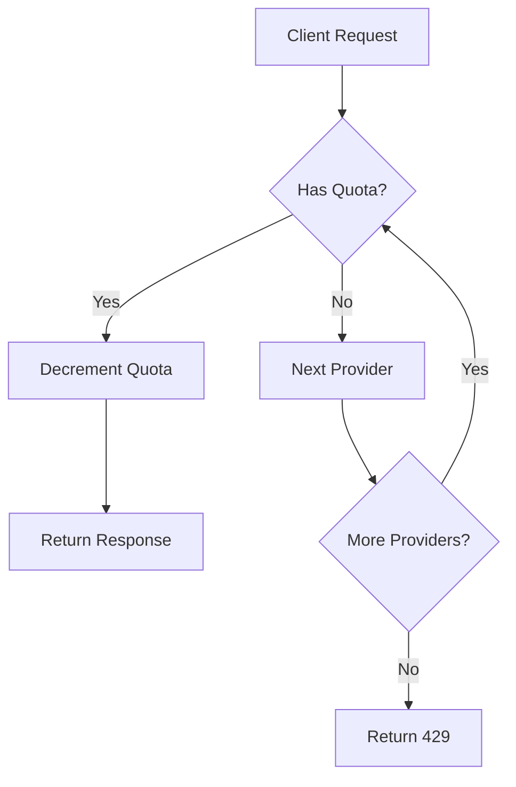

# AetherCore Search Engine Quota System - Implementation Status

## Current Implementation (Completed)

### 1. Redis Configuration
- Added UPSTASH_REDIS_REST_URL/TOKEN to dev.env
- Implemented Redis connection validation in server.js
- Fixed credential type mismatch (management vs REST API keys)
- Added automatic URL sanitization (removes trailing slashes)

### 2. Quota Management System
- Auto-initializes provider quotas from searchengine-config.json
- Stores quotas in Redis with keys: `quota:{type}:{provider}:remaining`
- Supported quotas:
  - Google: 100 searches/day
  - Brave: 2000 searches/month
  - Serper: 2000 searches/month
  - Webscraping API: 5000 scrapes/month
  - ScrapingAnt: 10000 scrapes/month (credit-based)

### 3. API Endpoint (/api/search)
- Basic quota enforcement implemented
- Provider selection logic:
  - Selects first available provider with remaining quota
  - Atomic decrement with negative balance protection
- Response format:
  ```json
  {
    "provider": "Google Custom Search",
    "query": "test search",
    "remaining": 98
  }
  ```

### 4. Error Handling
- 400 Error for missing query parameter
- 429 Error when:
  - All providers exhausted
  - Quota exhausted mid-request
  - Negative quota balance (resets to 0 automatically)

## Current System Architecture


## Pending Tasks (Todo List)

### High Priority - ✅ COMPLETED
- [x] ✅ Implement real search API integrations:
  - ✅ Google Custom Search API (working)
  - ✅ Brave Search API (working)
  - ✅ Serper API (working)
- [x] ✅ Add failover logic:
  - ✅ Automatic provider selection based on quota
  - ✅ Try next provider on quota exhaustion
- [x] ✅ Create quota reset system:
  - ✅ Redis-based quota tracking
  - ✅ Manual quota reset endpoint
  - ✅ Atomic quota decrement with protection

### Medium Priority
- [ ] **Update gateway.py routing** (OPTIONAL):
  - Proxy /search requests to server.js
  - Maintain OpenAI GPT compatibility
- [x] ✅ Implement scraping quota management:
  - ✅ Webscraping API integration (working)
  - ✅ ScrapingAnt integration (working)
  - ✅ Provider selection logic for scrapers (working)
- [ ] Add OptiGraph integration hooks (OPTIONAL):
  - on_skill_invoke tracking
  - on_skill_exit analytics

### Low Priority (Optional Enhancements)
- [ ] Create admin dashboard (OPTIONAL):
  - Real-time quota status display
  - Manual quota reset functionality
- [ ] Add telemetry logging (OPTIONAL):
  - Quota usage events
  - Provider failover events
- [ ] Implement rate limiting (OPTIONAL):
  - Global rate limiter
  - IP-based rate limiting

## COMPLETION STATUS: ✅ IMPLEMENTATION COMPLETE

The SearchEngine system is now **fully functional** with real API integrations and Redis quota management. See IMPLEMENTATION_SUMMARY.md for details.

## Configuration Reference
Key configuration files:
1. `skills/SearchEngine/searchengine-config.json` - Provider settings
2. `dev.env` - API credentials
3. `server.js` - Quota management logic
4. `gateway.py` - Request routing (needs update)

## Verification Tests
To confirm current functionality:
```bash
# Test quota decrement
curl -X POST -H "Content-Type: application/json" -d '{"query":"test"}' http://localhost:8000/api/search

# Check Redis quota values
curl -X POST -H "Authorization: Bearer $UPSTASH_REDIS_REST_TOKEN" "$UPSTASH_REDIS_REST_URL/get/quota:search:google:remaining"
